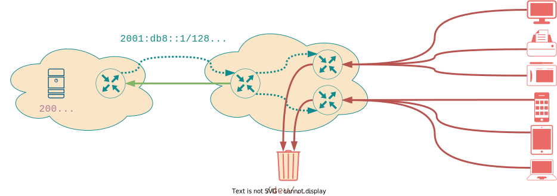
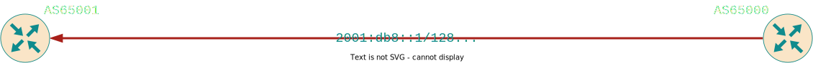
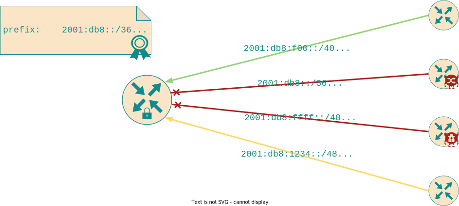
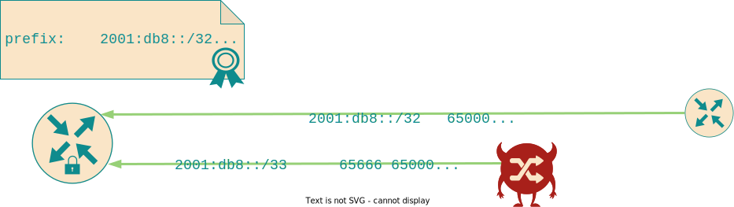
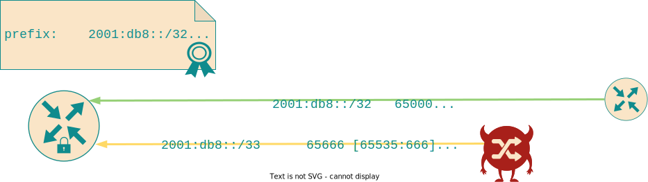
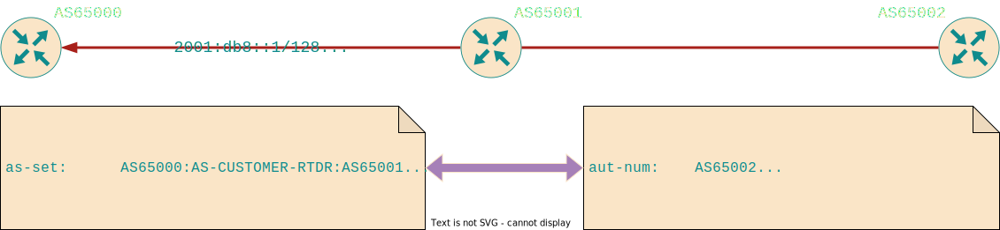

<!-- _class: lead invert -->
# Inter-domain Discard Route Signalling Security and the RPKI

**Ben Maddison**
[*benm@workonline.africa*](mailto:benm@workonline.africa)

# Terminology
<!-- _class: lead invert -->

"Remotely Triggered **Discard Route**" (RTDR)

==

"Remotely Triggered **Blackhole**" (RTBH)

# Background: RTDR signalling

- Sometimes, the only available response to a volumetric DDoS attack is to discard all traffic towards the victim
- Some of those times, by the time the traffic is close enough to drop, the damage is already done

Solution: ask an AS upstream to discard the traffic closer to the source using BGP

# Background: RTDR signalling (cont.)



See [RFC3882] and [RFC7999] for details.

[RFC3882]: https://www.rfc-editor.org/rfc/rfc3882
[RFC7999]: https://www.rfc-editor.org/rfc/rfc7999

# What could possibly go wrong?

Inter-domain RTDR can be destructive and fragile:

* Mis-origination/hijack of RTDR routes
* Accidental application of RFC7999 community
* Unauthorised addition of RFC7999 community upstream
* Accidental leakage of RTDR routes further upstream than intended
* Community name-space collisions

# RTDR Mis-origination



Is `AS65000` authorised to originate an RTDR route for `2001:db8::1/128`?

Solution: prefix-filtering using RPKI-ROV or IRR[*]

# Background: RPKI-based ROV



# Why not ROV?

RTDR routes are typically long prefixes, for maximum granularity

"Normal" unicast routes are generally at most /24 or /48

This leaves operators with two bad choices:

1. Force peers to create ROAs with very long `maxLength`; or
2. Exempt any path with `65535:666` from ROV policy

# Why not ROV? (cont.)

Bad option #1: Force peers to create ROAs with very long `maxLength`:

- Cripples ROV sub-prefix hijack protection for the covering unicast prefix



# Why not ROV? (cont..)

Bad option #2: Exempt any path with `65535:666` from ROV policy:

- Fails to provide even limited origin-based verification
- Still better than option #1



# RTDR attribution and scoping


- Did `AS64512` put `65535:666` there, or did `AS65000` add it?
- If it was added, was that authorised by `AS64512`?
- Was this RTDR supposed to be exported by `AS65000` or is it a leak?

Solution: None today (BGPsec and ASPA don't really help here)

# Proposal - RPKI DOA

Allow prefix-holders to signal to remote ASs the conditions for honoring RTDR requests:

- Which origins are authorised to inject RTDR routes
- Which communities will be used to signal RTDR intent
- Which prefix lengths RTDR routes may have
- Which peer ASs may an RTDR route be received from

# Object processing

ROA-like object processing:

- Based on [RFC6488] object template
- Prefix holder signs
- RP validates, flattens, and sends to BGP speaker via RTR protocol

[RFC6488]: https://www.rfc-editor.org/rfc/rfc6488

# Object `eContent`

High level structure:

``` asn1
DiscardOriginAuthorization ::= SEQUENCE {
     version             [0] INTEGER DEFAULT 0,
     ipAddrBlocks        IPListRange,
     originAsID          ASId,
     peerAsIDs           [1] SEQUENCE SIZE(1..MAX) OF ASId OPTIONAL,
     communities         [2] SEQUENCE SIZE(1..MAX) OF Community
  }
```

# Object `eContent` - `version`

Familiar version construct. Nothing to see here.

``` asn1
version             [0] INTEGER DEFAULT 0,
```

# Object `eContent` - `ipAddrBlocks`

List of IP prefixes covered by the object, and optional associated prefix length **ranges**

Permitted prefix length is /32 (IPv4) or /128 (IPv6) if ommitted

``` asn1
  IPListRange ::= SEQUENCE (SIZE(1..MAX)) OF IPAddressFamilyRange
  IPAddressFamilyRange ::= SEQUENCE {
     addressFamily        OCTET STRING (SIZE(2..3)),
     addressOrRange       IPAddressOrRange,
     prefixLengthRange    PrefixLengthRange OPTIONAL -- if omitted, assume hostroutes
  }
```

# Object `eContent` - `originAsID`

AS authorised to originate RTDR routes, exactly like a ROA

``` asn1
originAsID          ASId,
```

# Object `eContent` - `peerAsIDs`

Optional list of ASs authorised to announce RTDR routes

If omitted, only the AS in `originAsID` may announce RTDR routes (i.e. no transit allowed)

``` asn1
peerAsIDs           [1] SEQUENCE SIZE(1..MAX) OF ASId OPTIONAL,
```

# Object `eContent` - `communities`

List of BGP standard or large communities that identify a path as an RTDR route

``` asn1
  Community ::= CHOICE {
     bgpCommunity        [0] OCTET STRING (SIZE(4)),
     bgpLargeCommunity   [1] OCTET STRING (SIZE(12))
  }
```

# BGP Route Processing

A DOA describes the conditions for a BGP route to be processed as an RTDR signal

Each received BGP path is compared to the set of validated DOAs received from the RP

# BGP Route Processing (cont.)

Each route gets an "RTDR request validation state":

- **Matched**: a covering*, validated DOA object was found, and the constraints of the DOA were matched
- **Unmatched**: a covering*, validated DOA object was found , but the constraints of the DOA were not matched
- **NotFound**: no covering*, validated DOA object was found

[*]: using the definition in [RFC6811]

[RFC6811]: https://www.rfc-editor.org/rfc/rfc6811

# DOA Constraint Matching

A BGP route matches the constraints of a validated DOA iff:

- The length of the prefix is within the `prefixLengthRange` of the DOA; *and*
- The origin AS of the route matches the `originAsID`; *and*
- The AS from which the route was received matches the `originAsID` or appears in `peerAsIDs`; *and*
- The BGP route carries at least one standard or large community contained in `communities`

# ROV Co-existence & Import Policy

ROV validation state and RTDR request validation state are orthogonal - allowing RTDR routes to be identified up front:

``` rust
if route.doa_state == MATCH {
    // ... check some things
    route.next_hop = /dev/null;
    return ACCEPT
} else if route.rov_state == INVALID {
    return REJECT
} else {
    // ... other policy things ...
}
```

# Current Status

- [draft-spaghetti-sidrops-rpki-doa] currently being considered for adoption in SIDROPS
- Discussion somewhat stalled due to workload
- Operator input essential to move forward - please speak up!

[draft-spaghetti-sidrops-rpki-doa]: https://datatracker.ietf.org/doc/draft-spaghetti-sidrops-rpki-doa/

# FIN
<!-- _class: lead invert -->

# Backup slides
<!-- _class: lead invert -->

# Approximation using IRR

Bad option #2, above, can (must?) be augmented with IRR-based prefix filters.

"Standard" IRR-based filters are better than nothing, but don't help with attribution or transit authorisation.

# Approximation using IRR (cont.)



Using `mbrs-by-ref:` and `member-of:`, downstream customers can add themselves to an `as-set` maintained upstream.
